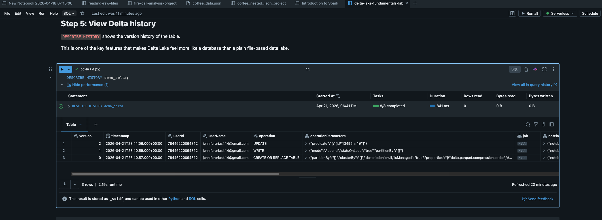
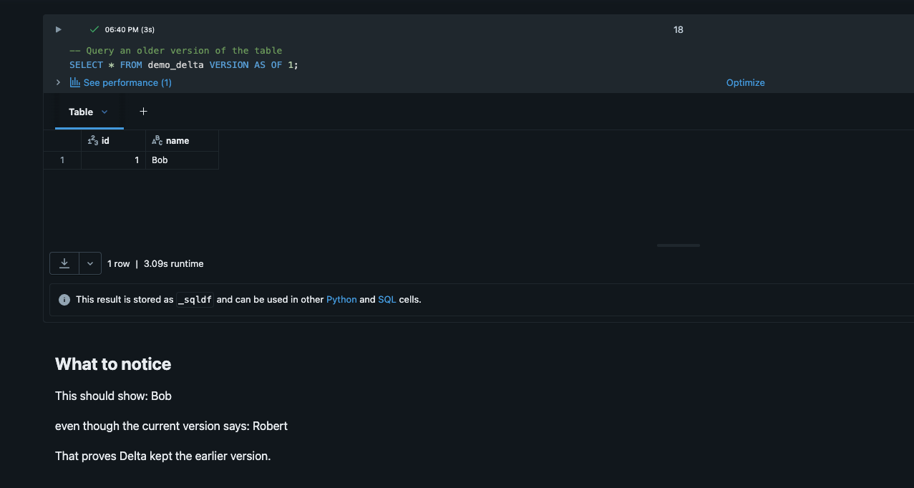
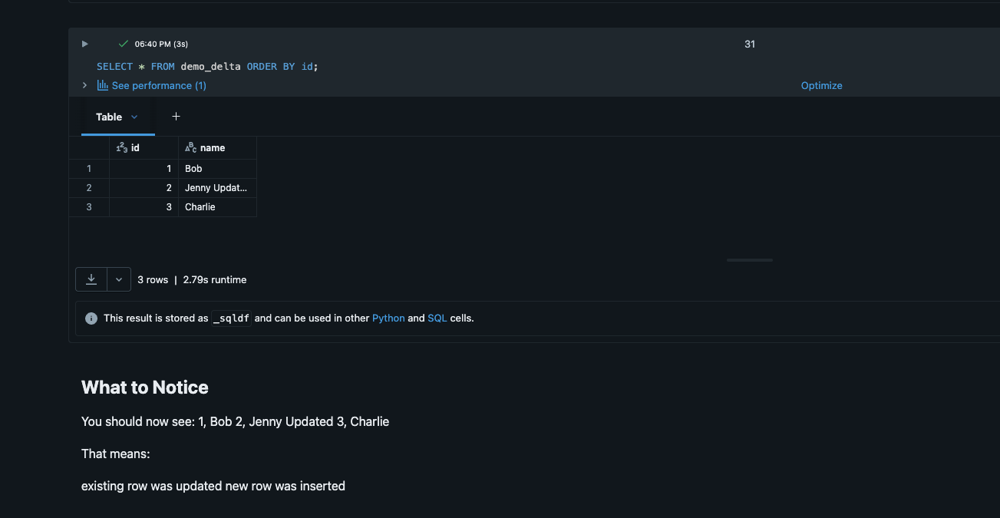
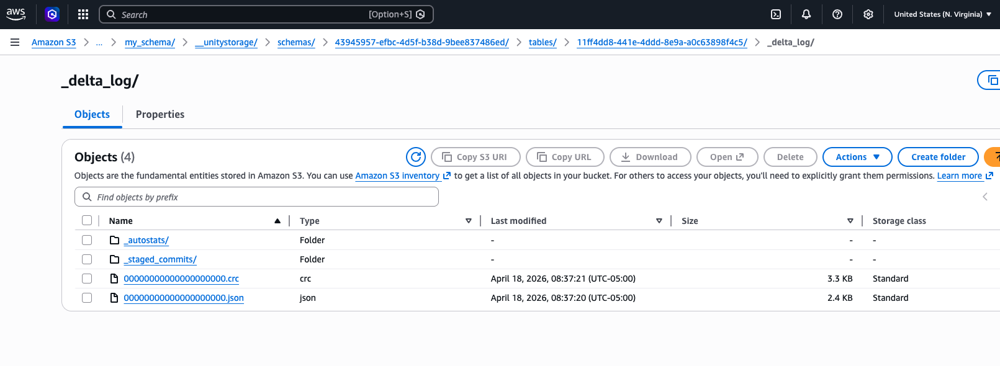

# Delta Lake Fundamentals Lab

## Overview
This project is a hands-on Databricks notebook demonstrating core Delta Lake functionality.

It shows how Delta Lake behaves more like a database than a traditional data lake by supporting versioning, updates, deletes, and time travel.

---

## Tools & Technologies
- Databricks
- SQL
- Delta Lake

---

## Concepts Covered
- Delta table creation
- Insert, update, and delete operations
- Delta transaction history (DESCRIBE HISTORY)
- Time travel using VERSION AS OF
- Merge / upsert logic (MERGE)
- Schema evolution
- Managed vs external table concepts

---

## Why This Matters
Delta Lake is a core component of modern data engineering workflows in Databricks.

This project demonstrates how data engineers:
- safely update and delete data  
- track historical changes  
- build reliable, versioned data pipelines  

---

## Key Features Demonstrated

### Time Travel
Query previous versions of a table:

SELECT * FROM demo_delta VERSION AS OF 1;

---

### Merge (Upsert)
Efficiently update and insert data:

MERGE INTO target  
USING source  
ON condition  
WHEN MATCHED THEN UPDATE  
WHEN NOT MATCHED THEN INSERT;

---

### Schema Evolution
Modify table structure over time:

ALTER TABLE demo_delta ADD COLUMNS (status STRING);

---

## Example Outputs

### Delta History (Versioning)



This shows how each operation creates a new version of the table.

---

### Time Travel



This demonstrates querying a previous version of the table before updates were applied.

---

### Final Table After Merge + Schema Evolution



This shows:
- updated records  
- inserted records via MERGE  
- new column added through schema evolution  

---

## Project Structure

```
notebooks/
  delta-lake-fundamentals-lab.py

images/
  delta_history.png
  time_travel.png
  final_table.png

README.md
```

---

## Delta Lake Storage (Under the Hood)

While working with Delta tables, I explored how data is physically stored in S3.

Even when using managed tables, Databricks stores:

- Data as Parquet files
- Transaction history in the `_delta_log` folder

Each operation (INSERT, UPDATE, ALTER) creates a new version recorded in `_delta_log`.



This enables:
- time travel
- version history
- reliable updates

---

## Key Takeaway
Delta Lake is a transaction layer on top of data lakes that enables:

- versioned data changes  
- reliable updates and deletes  
- historical tracking  
- database-like behavior on file-based storage  

---

## Future Improvements
- Add Change Data Feed (CDF) examples  
- Demonstrate external tables with S3  
- Add performance optimization techniques  
- Extend into Bronze → Silver pipeline  

---

## Notes
This project is part of my Data Engineering learning journey.

Focused on building consistency, hands-on experience, and GitHub-ready projects.
